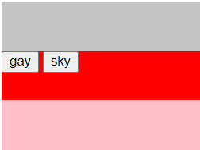
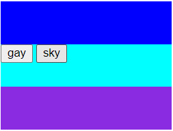

# themer
CSS variables based tool to integrate theme switching to website

## Example

In your HTML file

```
<body theme="gay">
    <header></header>
    <main>
        <button id="gay">gay</button>
        <button id="sky">sky</button>
    </main>
    <footer></footer>
</body>
```

In your CSS file

```
header,
footer,
main {
    width: 200px;
    height: 50px;
}
header {
    background-color: var(--header-color);
}
footer {
    background-color: var(--footer-color);
}
main {
    background-color: var(--body-color);
}
```

In your JS file

```
const themer = new Themer();

themer.createTheme('gay', {
    '--header-color': '#c4c4c4',
    '--body-color': 'red',
    '--footer-color': 'pink'
});
themer.createTheme('sky', {
    '--header-color': 'blue',
    '--body-color': 'aqua',
    '--footer-color': 'blueviolet'
});

document.getElementById('gay').addEventListener('click', () => themer.setTheme('gay'));
document.getElementById('sky').addEventListener('click', () => themer.setTheme('sky'));
```

Result


